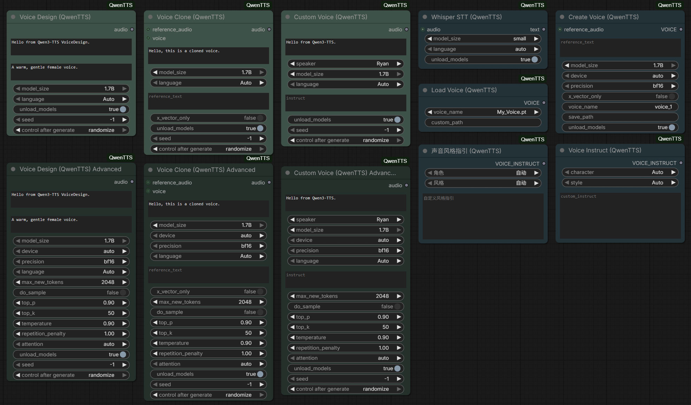

# Qwen3-TTS para ComfyUI — versão FrancosCorp

## 🐳 Instalação e Execução (Docker) — recomendado

### Pré-requisitos
- [Docker](https://docs.docker.com/get-docker/) + Docker Compose

### Rodar com Docker
```bash
docker compose up --build
```
Não é app standalone — é plugin do ComfyUI. Veja o README completo.

### Sem Docker (local)
```bash
# É um plugin (custom nodes) para ComfyUI
# copie a pasta para ComfyUI/custom_nodes/meu-qwen3-tts
```

**Custom nodes de Qwen3-TTS (12Hz) para ComfyUI**: CustomVoice, VoiceDesign e VoiceClone, com otimizações de VRAM para AMD ROCm e estabilidade em FP32.

[](https://www.python.org/)
[](https://github.com/comfyanonymous/ComfyUI)
[](LICENSE)
[](#)



---

## Sobre

Pacote de nós customizados que integra os modelos **Qwen3-TTS** ao ComfyUI, cobrindo três fluxos de trabalho de fala sintética: voz predefinida (**CustomVoice**), criação de voz por descrição em linguagem natural (**VoiceDesign**) e clonagem de voz (**VoiceClone**). É voltado para quem já usa ComfyUI e quer gerar áudio falado de alta qualidade sem montar pipelines de inferência à mão.

Esta é uma **versão derivada e otimizada** do projeto [ComfyUI-QwenTTS](https://github.com/1038lab/ComfyUI-QwenTTS) (autor original: 1038lab), mantida por **Rodolfo Franco (FrancosCorporation)**. As alterações próprias estão nos commits de "Versão Rodolfo Master", otimização de memória para AMD ROCm e estabilização de FP32 (ver `Update.md`).

## Funcionalidades

Comprovado pelo código (`nodes.py`, `AILab_QwenTTS_Tools.py`, `AILab_AudioDuration.py`):

- **Custom Voice** (básico e avançado): TTS com timbres predefinidos.
- **Voice Design** (básico e avançado): criação de vozes descritas em texto.
- **Voice Clone** (básico e avançado): clonagem a partir de áudio de referência + transcrição, com suporte opcional a entrada `VOICE` salva.
- **Create Voice / Load Voice**: cria e recarrega perfis de voz (`.pt`) na biblioteca de vozes.
- **Whisper STT**: transcrição de `AUDIO` para texto.
- **Voice Instruct (EN) / 声音风格指引 (ZH)**: presets de instrução de estilo, lidos de `voice_instruct.json` e `voice_instruct_zh.json`.
- **Audio Duration & Frames**: duração em segundos (`int`/`float`), cálculo de frames por `fps` e caminho do áudio.
- **Seleção de backend de atenção**: `auto / sage_attn / flash_attn / sdpa / eager`.
- **Multi-dispositivo**: seleção automática CUDA → MPS → CPU.
- **Download automático de modelos** do Hugging Face para `ComfyUI/models/TTS/Qwen3-TTS/<MODELO>/`.
- **Workflows de exemplo** em `example_workflows/` (CustomVoice, VoiceDesign, VoiceClone, Create Voice e integração com QwenASR).

### Diferenciais FrancosCorp

- Otimizado para **AMD ROCm 6.4**.
- **Gestão agressiva de VRAM** (`soft_empty_cache`, `torch.cuda.empty_cache`, `synchronize`) para evitar crashes em FP32.
- **Sincronização de tensores** injetada nos pontos de descarga para maior estabilidade.

## Stack

- **Python 3.10+** (o pacote vendorizado `qwen_tts/` também tem artefatos compilados para 3.12).
- **PyTorch / Torchaudio** (`torch>=2.9.1`), **Transformers** (`>=4.57.3`), **Accelerate**, **sentencepiece**, **tiktoken**.
- **librosa**, **soundfile**, **numpy**, **einops**, **openai-whisper**, **huggingface_hub**.
- Runtime do **ComfyUI** (`folder_paths`, `comfy.model_management`).
- JavaScript (1 arquivo de aparência em `web/js/appearance.js`).

Dependências declaradas em `requirements.txt` e `pyproject.toml`.

## Como rodar

Este projeto é um **custom node**: ele só funciona dentro de uma instalação do ComfyUI.

1) Coloque o repositório em `ComfyUI/custom_nodes/` (via ComfyUI-Manager ou `git clone`):

```bash
cd ComfyUI/custom_nodes
git clone https://github.com/FrancosCorporation/meu-qwen3-tts.git
```

2) Instale as dependências com o Python do ComfyUI:

```bash
python -m pip install -r ComfyUI/custom_nodes/meu-qwen3-tts/requirements.txt --no-cache-dir
```

3) Importe um dos workflows de `example_workflows/` (ex.: `QwenTTS_sample_workflow.json`) e execute uma vez — o primeiro uso baixa os modelos e faz o warm-up.

Modelos suportados (baixados automaticamente para `ComfyUI/models/TTS/Qwen3-TTS/<MODELO>/`):

| Modelo | Tamanho | Streaming | Instrução |
|---|---|---|---|
| CustomVoice | 1.7B | ✅ | ✅ |
| VoiceDesign | 1.7B | ✅ | ✅ |
| Base | 1.7B | ✅ | – |
| CustomVoice | 0.6B | ✅ | – |
| Base | 0.6B | ✅ | – |
| Tokenizer | 12Hz | – | – |

- [Qwen/Qwen3-TTS-12Hz-1.7B-CustomVoice](https://huggingface.co/Qwen/Qwen3-TTS-12Hz-1.7B-CustomVoice)
- [Qwen/Qwen3-TTS-12Hz-1.7B-VoiceDesign](https://huggingface.co/Qwen/Qwen3-TTS-12Hz-1.7B-VoiceDesign)
- [Qwen/Qwen3-TTS-12Hz-1.7B-Base](https://huggingface.co/Qwen/Qwen3-TTS-12Hz-1.7B-Base)
- [Qwen/Qwen3-TTS-12Hz-0.6B-CustomVoice](https://huggingface.co/Qwen/Qwen3-TTS-12Hz-0.6B-CustomVoice)
- [Qwen/Qwen3-TTS-12Hz-0.6B-Base](https://huggingface.co/Qwen/Qwen3-TTS-12Hz-0.6B-Base)
- [Qwen/Qwen3-TTS-Tokenizer-12Hz](https://huggingface.co/Qwen/Qwen3-TTS-Tokenizer-12Hz)

Download manual (útil em redes lentas/bloqueadas):

```bash
pip install -U "huggingface_hub[cli]"
huggingface-cli download Qwen/Qwen3-TTS-12Hz-1.7B-CustomVoice --local-dir ./Qwen3-TTS-12Hz-1.7B-CustomVoice
```

Depois mova a pasta para `ComfyUI/models/TTS/Qwen3-TTS/`. Caminhos alternativos de modelo podem ser configurados no `extra_model_paths.yaml` do ComfyUI (chave `tts`).

## Solução de problemas

- `'Qwen3TTSTalkerConfig' object has no attribute 'pad_token_id'` → versão incompatível de `transformers`. Corrija com:
  `pip install -U "transformers==4.57.3" "tokenizers<0.20" --no-cache-dir`
- **Áudio longo demais / zumbido no final** → reduza `max_new_tokens` (512–1024 para textos curtos) e use `do_sample=False`.
- **CUDA OOM** → divida textos longos em partes, reduza `max_new_tokens` e use `precision=bf16`.

## Estrutura do projeto

```
meu-qwen3-tts/
├── __init__.py                  # expõe NODE_CLASS_MAPPINGS ao ComfyUI
├── nodes.py                     # nós principais (CustomVoice/VoiceDesign/VoiceClone)
├── AILab_QwenTTS_Tools.py       # Create/Load Voice, Whisper STT, presets de instrução
├── AILab_AudioDuration.py       # nó de duração/frames
├── qwen_tts/                    # pacote de inferência vendorizado (core, tokenizers, inference)
├── example_workflows/           # workflows .json + imagens de exemplo
├── web/js/                      # ajustes visuais dos nós
├── voice_instruct*.json         # presets de estilo (EN/ZH)
├── requirements.txt / pyproject.toml
└── Update.md / README.md / LICENSE
```

## Licença

Código de integração sob **GPL-3.0** (ver [`LICENSE`](LICENSE)). Os modelos Qwen3-TTS são distribuídos sob **Apache-2.0** pela Alibaba Qwen Team — respeite as licenças dos modelos ao usar ou modificar este código.

## Créditos

- **Qwen3-TTS** — Alibaba Qwen Team.
- **[ComfyUI-QwenTTS](https://github.com/1038lab/ComfyUI-QwenTTS)** — projeto original de 1038lab, base desta versão.
- Comunidade ComfyUI.
