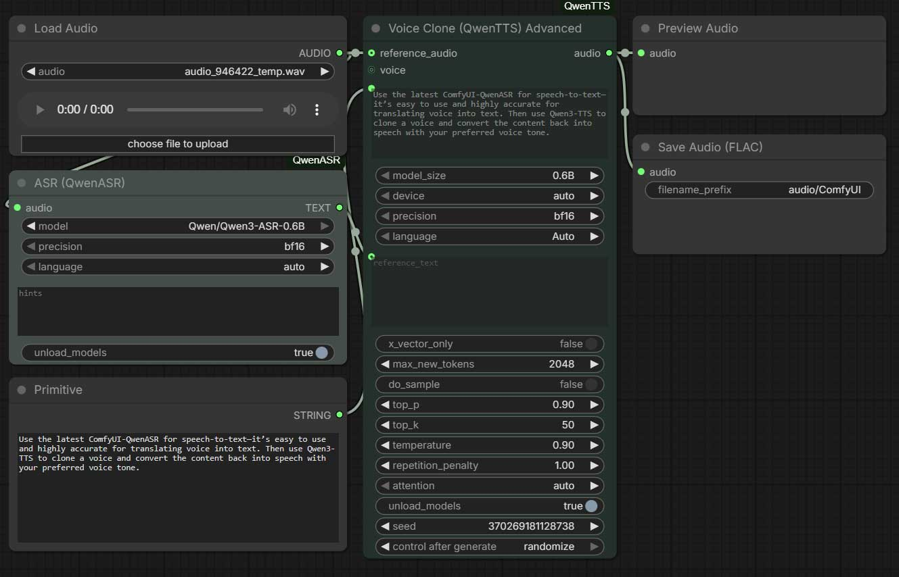
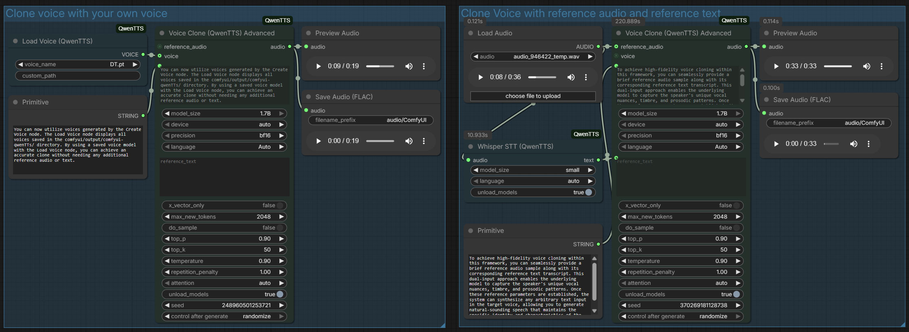

# update v1.1.4
- new workflow work with new released [ComfyUI-QwenAR](https://github.com/1038lab/ComfyUI-QwenASR)
 [Workflow](example_workflows/Voice_Clone-with-QwenASR.json)
# update v1.1.3
- Dependence update and bug fixed
# Update v1.1.0

## Highlights
- Voice Clone nodes now support `VOICE` inputs from the Voices Library for stable reuse.
- New Tools bundle: Create Voice, Load Voice, Whisper STT, and Voice Instruct presets (EN + CN).
- Advanced nodes now expose attention selection (auto / sage_attn / flash_attn / sdpa / eager).
- README expanded with ComfyUI `extra_model_paths.yaml` guidance for custom model locations.
- Audio Duration node rewritten: cleaner logic, seconds-based outputs, optional frame calculation.
- 5 new sample workflows (v1.1.0):
  - [Clone_Voice.json](example_workflows/Clone_Voice.json) — Voice Clone demo workflow (2 variants).
  - [Create_your_voice.json](example_workflows/Create_your_voice.json) — Create and save your own voice profile.
  - [QwenTTS_Nodes.json](example_workflows/QwenTTS_Nodes.json) — Overview of all custom nodes in this repo.
  - [QwenTTS_sample_workflow.json](example_workflows/QwenTTS_sample_workflow.json) — Sample nodes for Voice Clone, Voice Design, and Custom Voice.
  - [Voice_design.json](example_workflows/Voice_design.json) — Advanced Voice Design + preset voice instruct nodes (EN/ZH).

## New / Updated Nodes
- Create Voice (QwenTTS)
  - Build and save voice prompts to `.pt` in `ComfyUI/output/qwen3-tts_voices` by default.
- Load Voice (QwenTTS)
  - Load saved voices or use a custom path and output `VOICE`.
- Whisper STT (QwenTTS)
  - Transcribe `AUDIO` to text with multiple model sizes.
- Voice Clone (QwenTTS) / Voice Clone (QwenTTS) Advanced
  - Added optional `voice` input; `reference_audio` is only required if no voice is provided.
- Voice Instruct (QwenTTS)
  - English preset builder from `voice_instruct.json`.
- 声音风格指引 (QwenTTS)
  - Chinese preset builder from `voice_instruct_zh.json`.

## Audio Duration
- Outputs: `duration_int` (seconds), `duration_float` (seconds), `frames`, `audio_path`.
- Optional `fps` input enables frame calculation.
